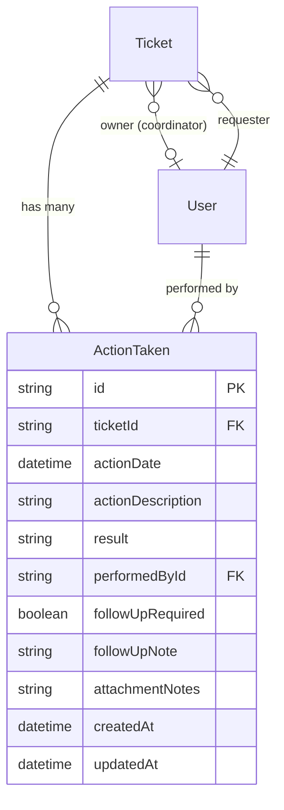

# Lab 4 Sprint Engineering Specification: TokTickIT Actions Taken, Dashboards, and Final Regression

## 1. Sprint Goal
Deliver the complete end-to-end TokTickIT service-desk lifecycle by implementing parent-child **Actions Taken** work logging under Tickets with independent actor attribution, enforcing the final authoritative **Ticket Status Transition Lifecycle** and Resolution Gate rules, delivering role-tailored operational **Dashboards** for Requesters, IT Staff, and Administrators with backend-authoritative aggregations, and hardening the entire application under the Zen Green design system with zero regression across Labs 1 through 3.

## 2. Stakeholder Request Interpretation
The TokTickIT service desk currently facilitates ticket intake, ownership claiming, public communication, and internal notes. However, operations teams require a structured, traceable mechanism to plan, execute, and record actual work activities performed on each ticket. 

To address this:
1. **Actions Taken**: Each ticket must support multiple chronologically recorded Actions Taken lines. Each entry captures action date/time, action description, result, automatically attributed actor (`performedBy`), follow-up requirement flag, mandatory follow-up notes (when required), and attachment notes. Crucially, while a designated primary Ticket Owner coordinates the ticket as a whole, any qualified IT Staff member or Administrator may perform and log specific actions on that ticket. Requesters must be able to view all Actions Taken on tickets they own to maintain transparency, while write access is strictly guarded.
2. **Ticket Lifecycle & Resolution Gate**: The system must enforce the full status lifecycle across all 8 statuses (`NEW`, `OPEN`, `IN_PROGRESS`, `WAITING_FOR_REQUESTER`, `RESOLVED`, `CLOSED`, `REOPENED`, `CANCELLED`). While Requesters may indicate that an issue appears resolved (advisory indicator), only IT Staff or Administrators may formally evaluate the completed work and transition the ticket to `RESOLVED` or `CLOSED`. Stale and concurrent updates must be safely rejected.
3. **Role-Appropriate Dashboards**: Requesters, IT Staff, and Administrators require concise operational starting points. Requesters need visibility into their active tickets, items awaiting their input, and recently resolved items. IT Staff need rapid insight into unassigned tickets, tickets assigned to themselves, high/urgent priority items, and recent queue activity. Administrators need operational visibility alongside user account summaries. All metrics must be computed authoritatively by the backend and offer direct drill-down links to filtered lists.
4. **Final Regression & Hardening**: The complete system must be polished, responsive across desktop, tablet, and mobile viewports, accessible, free of broken links or console errors, and fully verified through traceable automated tests.

---

## 3. Scope

### 3.1 Included Scope
- **Actions Taken Parent-Child Structure**:
  - Relational model in PostgreSQL where one Ticket contains zero, one, or many Actions Taken entries.
  - Fields: `id`, `ticketId`, `actionDate`, `actionDescription`, `result`, `performedById` (auto-populated from authenticated session), `followUpRequired`, `followUpNote` (mandatory when `followUpRequired = true`), `attachmentNotes`, `createdAt`, `updatedAt`.
  - Actor independence: Primary ticket coordinator remains assigned to `ownerId`, while Actions Taken entries record distinct `performedById` contributors.
  - Role visibility: IT Staff and Admins create and edit Actions Taken; Requesters possess read-only visibility on owned tickets.
- **Complete Ticket Status Transition Matrix & Resolution Gate**:
  - Strict backend enforcement of valid status transitions across all 8 statuses (`NEW`, `OPEN`, `IN_PROGRESS`, `WAITING_FOR_REQUESTER`, `RESOLVED`, `CLOSED`, `REOPENED`, `CANCELLED`).
  - Strict separation between the Requester's advisory "Problem Appears Resolved" flag (`isResolvedByUser = true`) and authoritative formal status transition to `RESOLVED`.
  - Backend enforcement rejecting client bypass attempts with HTTP 400 / HTTP 403.
  - Concurrency collision detection returning HTTP 409 `STALE_UPDATE_CONFLICT` when updating outdated ticket versions.
- **Role-Appropriate Dashboards**:
  - **Requester Dashboard**: Total open tickets count, tickets waiting for requester count, recently updated tickets, recently resolved tickets, and quick actions (`Create Ticket`, `View My Tickets`).
  - **IT Staff Dashboard**: Unassigned tickets count, tickets owned by current user count, tickets grouped by status or IT Priority, recent operational tickets queue, and quick actions.
  - **Administrator Dashboard**: Inherits IT Staff operational metrics with concise user-account summary counters (`activeUsers`, `activeStaff`, `activeAdmins`).
  - Backend authoritative queries calculating summary metrics (no raw full collection filtering on the client) with documented empty states and query parameters for accessible drill-down navigation.
- **Database Schema Evolution, Migration & Backfill**:
  - PostgreSQL schema evolution via Prisma, safe data migration preserving 100% of data from Labs 1–3, backfill strategy for legacy tickets with zero Actions Taken, and rollback/recovery documentation.
  - Idempotent seed script generating tickets across all 8 statuses, varying counts of Actions Taken (0, 1, multiple), and non-zero/zero dashboard scenarios.
- **Zen Green UI & Full Application Hardening**:
  - Consistent Zen Green tokens, accessible metric cards, modals, tables, badges, and responsive layouts across Desktop ($\ge 1280\text{px}$), Tablet ($768\text{px} - 1024\text{px}$), and Mobile ($375\text{px} - 480\text{px}$).
  - Accessibility standards: Touch targets $\ge 44\text{px}$, visible keyboard focus indicators, non-color status cues, zero horizontal overflow, and modal focus management.
  - Zero regression across all Lab 1–3 features: Authentication, RBAC, Requester Tickets, Attachments, Public Comments, Internal Notes, and Administrator User Management.

### 3.2 Explicitly Excluded Scope
- Automatic SLA countdown timers, breach notification emails, escalation engines, and on-call rotation schedules.
- External push notification channels (Email, SMS, LINE, Webhook, push notifications).
- Inventory consumption, spare-parts tracking, procurement workflows, or service cost accounting.
- Timesheet billing, payroll, labor rate calculations, or billable hour exports.
- Multi-level approval chains, hierarchical sign-offs, and cryptographic digital signatures.
- Advanced Business Intelligence (BI) dashboards, ad-hoc query builders, or OLAP data warehouse integrations.
- Multi-tenant organizations, department billing, or multi-region cloud infrastructures.
- New unapproved product features not specified in this Sprint 4 engineering contract.

---

## 4. Functional Requirements

### 4.1 Actions Taken Requirements
- **FR-01**: The system shall allow authenticated IT Staff and Administrators to create new Actions Taken entries under any accessible ticket.
- **FR-02**: The system shall automatically bind the `performedBy` attribute of an Actions Taken entry to the authenticated user from the verified Bearer token session.
- **FR-03**: The system shall allow authenticated IT Staff and Administrators to update existing Actions Taken entries under accessible tickets.
- **FR-04**: The system shall enforce that when `followUpRequired` is marked `true`, a non-empty `followUpNote` must be provided; otherwise, the request shall be rejected with HTTP 400 `FOLLOWUP_NOTE_REQUIRED`.
- **FR-05**: The system shall reject Action Taken creation or modification attempts if the authenticated user account is inactive, returning HTTP 400 `INACTIVE_ACTOR_REJECTED`.
- **FR-06**: The system shall allow authenticated Requesters to view all Actions Taken entries recorded on tickets they own, but shall strictly prohibit Requesters from creating, modifying, or deleting Actions Taken (HTTP 403 `FORBIDDEN`).
- **FR-07**: The system shall prohibit any user from recording an Actions Taken entry under a cancelled or closed ticket, rejecting requests with HTTP 400 `TICKET_LOCKED`.

### 4.2 Ticket Status & Resolution Workflow Requirements
- **FR-08**: The system shall enforce permitted status transitions across all 8 defined statuses (`NEW`, `OPEN`, `IN_PROGRESS`, `WAITING_FOR_REQUESTER`, `RESOLVED`, `CLOSED`, `REOPENED`, `CANCELLED`) according to the approved status transition matrix.
- **FR-09**: The system shall reject any disallowed status transition with HTTP 400 `INVALID_STATUS_TRANSITION`.
- **FR-10**: The system shall provide an advisory resolution indicator (`POST /api/v1/tickets/:id/resolve-indicator`) callable by the owning Requester, which updates `isResolvedByUser` to `true` without altering the formal `status` field.
- **FR-11**: The system shall require that formal transition to `RESOLVED` status be executed exclusively by authenticated IT Staff or Administrators (`PATCH /api/v1/tickets/:id/status`).
- **FR-12**: The system shall detect stale or concurrent status updates using timestamp/version checking, returning HTTP 409 `STALE_UPDATE_CONFLICT` when incoming updates conflict with recent modifications.

### 4.3 Role Dashboards Requirements
- **FR-13**: The system shall provide a Requester Dashboard endpoint (`GET /api/v1/dashboard/requester`) returning authoritative metrics, recent tickets, and recently resolved tickets scoped strictly to the authenticated Requester.
- **FR-14**: The system shall provide an IT Staff Dashboard endpoint (`GET /api/v1/dashboard/staff`) returning operational metrics (New, Open, In Progress, Waiting for Requester, My Assigned, Unassigned, Urgent, High), current-user Actions Taken (total count and recent entries), and recent queue activity.
- **FR-15**: The system shall provide Administrators accessing the dashboard with operational metrics plus system user account metrics (`activeUsers`, `activeStaff`, `activeAdmins`).
- **FR-16**: All dashboard metrics cards shall provide accessible drill-down destinations linking to filtered lists in the Ticket Queue or My Tickets views.

### 4.4 Hardening & Regression Requirements
- **FR-17**: The system shall maintain 100% backward compatibility with all Requester, IT Staff, and Administrator endpoints from Labs 1, 2, and 3.
- **FR-18**: The application shell shall display responsive, role-appropriate navigation linking to the role's respective Dashboard as the primary landing page upon login.
- **FR-19**: The client application shall handle loading, empty, forbidden, stale-update, and network failure states gracefully without unhandled exceptions or broken views.
- **FR-20**: All interactive controls shall meet WCAG accessibility standards, maintaining minimum $44 \times 44\text{px}$ touch targets, visible focus outlines, and non-color dependent status cues.

---

## 5. Business Rules

### 5.1 Actions Taken Rules
- **BR-01**: An Action Taken belongs to exactly one Ticket (Parent-Child relationship).
- **BR-02**: The Ticket Owner coordinates the Ticket as a whole, but Actions Taken may be performed and recorded by different IT Staff members or Administrators.
- **BR-03**: The `performedBy` field of an Action Taken is authoritative and immutable once created, reflecting the authenticated user who recorded the action.
- **BR-04**: The authenticated IT Staff or Administrator performing an Action Taken operation (creation or update) must have an active account (`isActive = true`). If the calling user is inactive, the operation is rejected with HTTP 400 `INACTIVE_ACTOR_REJECTED`. The original `performedById` attribution on an existing Action Taken remains immutable even if that original contributor later becomes inactive.
- **BR-05**: If `followUpRequired` is `true`, `followUpNote` must contain non-whitespace text. If `followUpRequired` is `false`, `followUpNote` is optional or null.
- **BR-06**: Actions Taken entries are chronologically ordered by `actionDate` ascending.
- **BR-07**: Requesters possess read-only visibility for Actions Taken on their owned tickets. Requesters are strictly forbidden from creating, modifying, or deleting Actions Taken entries.

### 5.2 Ticket Status & Resolution Rules
- **BR-08**: The canonical ticket lifecycle supports 8 discrete statuses: `NEW`, `OPEN`, `IN_PROGRESS`, `WAITING_FOR_REQUESTER`, `RESOLVED`, `CLOSED`, `REOPENED`, and `CANCELLED`.
- **BR-09**: Permitted status transitions are defined strictly by the transition matrix below:

| Current Status | Permitted Next Statuses | Authorized Roles |
| :--- | :--- | :--- |
| `NEW` | `OPEN`, `CANCELLED` | `IT_STAFF`, `ADMIN` |
| `OPEN` | `IN_PROGRESS`, `WAITING_FOR_REQUESTER`, `RESOLVED`, `CANCELLED` | `IT_STAFF`, `ADMIN` |
| `IN_PROGRESS` | `WAITING_FOR_REQUESTER`, `RESOLVED`, `CANCELLED` | `IT_STAFF`, `ADMIN` |
| `WAITING_FOR_REQUESTER`| `IN_PROGRESS`, `RESOLVED`, `CANCELLED` | `IT_STAFF`, `ADMIN` |
| `RESOLVED` | `CLOSED`, `REOPENED` | `IT_STAFF`, `ADMIN` |
| `REOPENED` | `IN_PROGRESS`, `WAITING_FOR_REQUESTER`, `RESOLVED`, `CANCELLED` | `IT_STAFF`, `ADMIN` |
| `CLOSED` | None (Terminal) | None |
| `CANCELLED` | None (Terminal) | None |

- **BR-10**: The Requester's "Problem Appears Resolved" indication (`isResolvedByUser = true`) is strictly advisory. It does not alter the formal `status` of the ticket to `RESOLVED`.
- **BR-11 (Resolution Gate Rule)**: A ticket cannot transition to `RESOLVED` unless the backend resolution gate conditions are strictly satisfied:
  1. **Authorized Role**: The authenticated actor must have role `IT_STAFF` or `ADMIN`. Requesters are strictly forbidden.
  2. **Permitted Current Status**: The ticket must currently be in an eligible status (`OPEN`, `IN_PROGRESS`, or `WAITING_FOR_REQUESTER`).
  3. **Decoupled Advisory Indicator**: A Requester's `isResolvedByUser` indication is an advisory cue that does NOT satisfy or bypass this gate on its own.
  4. **Concurrency Guard**: Incoming `expectedUpdatedAt` must match the current database record without stale conflict.
  If any condition fails, the backend rejects the transition with HTTP 400 (`INVALID_STATUS_TRANSITION`), HTTP 403 (`FORBIDDEN`), or HTTP 409 (`STALE_UPDATE_CONFLICT`).
- **BR-12**: Once a ticket reaches `CLOSED` or `CANCELLED`, it is terminal and immutable; no further status transitions or Actions Taken entries are permitted.

### 5.3 Role Dashboard Calculation Rules
- **BR-13 (Requester Dashboard)**:
  - **My Open Tickets Count**: Sum of tickets owned by requester where `status IN ('NEW', 'OPEN', 'IN_PROGRESS', 'WAITING_FOR_REQUESTER')`. Drill-down: `/my-tickets?status=open_all`.
  - **Waiting for Requester Count**: Sum of tickets owned by requester where `status = 'WAITING_FOR_REQUESTER'`. Drill-down: `/my-tickets?status=WAITING_FOR_REQUESTER`.
  - **Resolved Tickets Count**: Sum of tickets owned by requester where `status = 'RESOLVED'`. Drill-down: `/my-tickets?status=RESOLVED`.
  - **Closed Tickets Count**: Sum of tickets owned by requester where `status = 'CLOSED'`. Drill-down: `/my-tickets?status=CLOSED`.
  - **My Recent Tickets**: Up to 5 most recently updated tickets owned by requester, sorted by `updatedAt DESC`.
  - **Recently Resolved Tickets**: Deterministic list limited to the top 5 most recently resolved tickets owned by requester (`status = 'RESOLVED'`, ordered by `updatedAt DESC`, `take: 5`). Empty behavior: returns `[]` when no resolved tickets exist. Drill-down: `/my-tickets?status=RESOLVED`.
- **BR-14 (IT Staff Dashboard)**:
  - **Primary Operational Metric Cards (6 Cards)**:
    - **New Tickets Count** (`newCount`): Count of active tickets where `status = 'NEW'`. Drill-down: `/staff/tickets?status=NEW`.
    - **Open Tickets Count** (`openCount`): Count of active tickets where `status = 'OPEN'`. Drill-down: `/staff/tickets?status=OPEN`.
    - **In Progress Count** (`inProgressCount`): Count of active tickets where `status = 'IN_PROGRESS'`. Drill-down: `/staff/tickets?status=IN_PROGRESS`.
    - **Waiting for Requester Count** (`waitingForRequesterCount`): Count of active tickets where `status = 'WAITING_FOR_REQUESTER'`. Drill-down: `/staff/tickets?status=WAITING_FOR_REQUESTER`.
    - **My Assigned Count** (`myAssignedCount`): Count of active tickets where `ownerId = currentUserId` and `status NOT IN ('CLOSED', 'CANCELLED')`. Drill-down: `/staff/tickets?ownership=assigned_to_me`.
    - **Unassigned Count** (`unassignedCount`): Count of active tickets where `ownerId IS NULL` and `status NOT IN ('CLOSED', 'CANCELLED')`. Drill-down: `/staff/tickets?ownership=unassigned`.
  - **Priority Attention Counters**:
    - **Urgent Priority Count** (`urgentCount`): Count of active tickets where `itPriority = 'URGENT'` and `status NOT IN ('CLOSED', 'CANCELLED')`. Drill-down: `/staff/tickets?priority=URGENT`.
    - **High Priority Count** (`highCount`): Count of active tickets where `itPriority = 'HIGH'` and `status NOT IN ('CLOSED', 'CANCELLED')`. Drill-down: `/staff/tickets?priority=HIGH`.
  - **Current-User Actions Taken**:
    - `myActionsCount`: Total count of Actions Taken recorded by current user (`performedById = currentUserId`).
    - `myRecentActions`: Deterministic list of up to 5 most recent Actions Taken performed by the current user (`performedById = currentUserId`, ordered by `actionDate DESC`, `take: 5`). Each entry includes `actionDate`, `actionDescription`, `result`, `followUpRequired`, and ticket details (`id`, `ticketNumber`, `title`, `status`). Drill-down: Navigates to `/staff/tickets/:ticketId#actions-taken`. Empty behavior: returns `[]` when no actions have been recorded.
  - **Recent Tickets**: Up to 5 most recently updated tickets across the entire service desk, sorted by `updatedAt DESC`.
- **BR-15 (Administrator Dashboard)**:
  - Inherits all operational metrics from BR-14.
  - Adds authoritative user metrics: Total Active Users, Total Active IT Staff, Total Active Administrators.
- **BR-16**: All dashboard metrics must be computed authoritatively by the backend PostgreSQL database using SQL aggregations. Clients must not fetch full ticket collections to compute counts client-side.

### 5.4 Concurrency, Security & Failure Rules
- **BR-17**: Any update to Ticket Status, Actions Taken creation/modification, or Advisory Resolution indication MUST supply the current resource `updatedAt` / `expectedTicketUpdatedAt` timestamp as a mandatory field. If the database record contains a newer timestamp, the update must fail with HTTP 409 `STALE_UPDATE_CONFLICT`.
- **BR-18**: In the event of a validation or concurrency error, client input forms must preserve all entered user values to allow immediate recovery without data re-entry.
- **BR-19**: Double-clicking submission buttons or rapid repeated network requests must be debounced/disabled to prevent duplicate action creation.

---

## 6. Role-Based Authorization Matrix

| Operational Capability | Requester | IT Staff | Administrator |
| :--- | :---: | :---: | :---: |
| View Own Dashboard (`/dashboard`) | ✅ Own data only | ❌ Redirected | ❌ Redirected |
| View IT Staff Dashboard (`/dashboard`) | ❌ Forbidden | ✅ Full Queue Metrics | ✅ Full Queue Metrics |
| View Admin User Summary Metrics | ❌ Forbidden | ❌ Forbidden | ✅ Full Access |
| View Actions Taken on Owned Ticket | ✅ View Only | ✅ Full View | ✅ Full View |
| View Actions Taken on Other Tickets | ❌ Forbidden | ✅ Full View | ✅ Full View |
| Create Action Taken on Ticket | ❌ Forbidden | ✅ Allowed | ✅ Allowed |
| Edit Action Taken on Ticket | ❌ Forbidden | ✅ Allowed | ✅ Allowed |
| Mark "Problem Appears Resolved" (Advisory)| ✅ Owned Tickets | ❌ N/A | ❌ N/A |
| Transition Ticket to `RESOLVED` / `CLOSED`| ❌ Forbidden | ✅ Allowed (Matrix) | ✅ Allowed (Matrix) |
| Claim / Reassign Ticket Owner | ❌ Forbidden | ✅ Allowed | ✅ Allowed |
| Manage User Accounts | ❌ Forbidden | ❌ Forbidden | ✅ Full Access |

---

## 7. Data Changes & Architecture Decisions

### 7.1 Data Models & Relationships

#### Detailed `ActionTaken` Schema:
- `id`: `String` (UUID / Cuid, Primary Key)
- `ticketId`: `String` (Foreign Key referencing `Ticket.id`, `onDelete: Cascade`)
- `actionDate`: `DateTime` (Defaults to `now()`)
- `actionDescription`: `String` (Text, required, min 1 char)
- `result`: `String` (Text, required, min 1 char)
- `performedById`: `String` (Foreign Key referencing `User.id`, `onDelete: Restrict`)
- `followUpRequired`: `Boolean` (Default: `false`)
- `followUpNote`: `String?` (Nullable text; required if `followUpRequired = true`)
- `attachmentNotes`: `String?` (Nullable text describing physical/digital files or reference evidence)
- `createdAt`: `DateTime` (Default: `now()`)
- `updatedAt`: `DateTime` (`@updatedAt` for optimistic locking)

### 7.2 Database Design Decisions Justification (Minimum 2 Required)
1. **Decision 1: Decoupling `performedById` on `ActionTaken` from Ticket `ownerId`**:
   - *Rationale*: A core requirement of Sprint 4 is that a ticket has one primary Ticket Owner who coordinates overall resolution, but multiple distinct IT Staff members may execute and log discrete actions (e.g. initial triage, hardware inspection, vendor communication). Storing an explicit `performedById` on each `ActionTaken` row guarantees full auditability and enables multi-technician collaboration without overwriting or confusing ticket ownership.
2. **Decision 2: Compound Index on `ActionTaken(ticketId, actionDate ASC)`**:
   - *Rationale*: Actions Taken entries are always queried in the context of a specific ticket and must be rendered chronologically to preserve the operational narrative. A compound index on `(ticketId, actionDate ASC)` allows PostgreSQL to perform an indexed B-tree scan directly satisfying both the relational filter and sort order without a separate in-memory filesort.
3. **Decision 3: Server-side Optimistic Concurrency via `updatedAt`**:
   - *Rationale*: In a multi-user service desk, multiple staff members or requesters may view and act upon the same ticket concurrently. By verifying that the client's submitted `updatedAt` matches the database record, stale updates are prevented deterministically with HTTP 409 `STALE_UPDATE_CONFLICT`, preventing accidental overwriting of recent workflow changes.

### 7.3 Migration, Backfill & Rollback Strategy
- **Migration**:
  - Prisma migration creates the `ActionTaken` table and associated foreign key constraints and indexes.
  - Zero destructive changes: Existing `User`, `Ticket`, `Attachment`, `Comment`, and `InternalNote` tables and columns are strictly preserved.
- **Legacy Backfill**:
  - Legacy tickets created during Labs 1–3 possess zero Actions Taken.
  - No synthetic placeholder actions will be injected; legacy tickets will naturally return an empty array (`actionsTaken: []`).
  - Ticket query serializers and UI components must handle `actionsTaken: []` gracefully without crashing or displaying broken tables.
- **Rollback & Recovery**:
  - In the event of an unexpected migration interruption or failure, deployment must halt immediately and recovery must restore the pre-migration schema and data state using the project's approved database recovery procedure. Zero existing Lab 1–3 data may be lost.

### 7.4 Idempotent Seed Data Strategy
The updated seed script (`server/prisma/seed.ts`) will:
1. Guarantee idempotency: Running `npm run db:seed` multiple times produces consistent, non-duplicated datasets.
2. Populate tickets across all 8 statuses (`NEW`, `OPEN`, `IN_PROGRESS`, `WAITING_FOR_REQUESTER`, `RESOLVED`, `CLOSED`, `REOPENED`, `CANCELLED`).
3. Seed tickets with varied Actions Taken profiles:
   - Tickets with 0 Actions Taken (legacy behavior).
   - Tickets with 1 Action Taken.
   - Tickets with multiple Actions Taken logged by different IT Staff members.
   - Actions with `followUpRequired = true` and comprehensive `followUpNote`.
4. Populate realistic distributions ensuring non-zero and zero counts across Requester and IT Staff dashboard metric cards.

---

## 8. REST API Contract Summary

Refer to [api-spec.md](./api-spec.md) for full request/response schemas.

| Method | Endpoint | Authorized Roles | Description | Status Codes |
| :--- | :--- | :--- | :--- | :--- |
| `GET` | `/api/v1/tickets/:id/actions-taken` | `REQUESTER` (own), `IT_STAFF`, `ADMIN` | Get all actions taken for a ticket | 200, 401, 403, 404 |
| `POST` | `/api/v1/tickets/:id/actions-taken` | `IT_STAFF`, `ADMIN` | Create an action taken | 201, 400, 401, 403, 404, 409 |
| `PATCH`| `/api/v1/tickets/:id/actions-taken/:actionId` | `IT_STAFF`, `ADMIN` | Update an action taken | 200, 400, 401, 403, 404, 409 |
| `PATCH`| `/api/v1/tickets/:id/status` | `IT_STAFF`, `ADMIN` | Transition ticket status | 200, 400, 401, 403, 404, 409 |
| `POST` | `/api/v1/tickets/:id/resolve-indicator` | `REQUESTER` (own) | Advisory resolution signal | 200, 401, 403, 404, 409 |
| `GET` | `/api/v1/dashboard/requester` | `REQUESTER` | Requester summary metrics | 200, 401, 403 |
| `GET` | `/api/v1/dashboard/staff` | `IT_STAFF`, `ADMIN` | IT Staff operational metrics | 200, 401, 403 |

---

## 9. UI Specification Summary

Refer to [ui-spec.md](./ui-spec.md) for detailed layouts, component structures, and visual rules.

- **Design Language**: Zen Green Theme (`#006B3C` primary brand, `#F5F7F6` canvas, `#FFFFFF` cards, `#D5DDD8` borders).
- **IT Staff Dashboard (`/dashboard`)**:
  - Welcome banner with greeting and refresh trigger.
  - 6 primary operational metric cards (`New`, `Open`, `In Progress`, `Waiting for Requester`, `My Assigned`, `Unassigned`) with delta indicators and drill-down links.
  - Priority Attention banner with direct filters for `Urgent` and `High` priority tickets.
  - "Recent Queue Tickets" table showing 5 most recent tickets across the service desk.
  - "My Recent Actions Taken" table showing up to 5 most recent actions recorded by the current user with drill-down links to `/staff/tickets/:ticketId#actions-taken`.
  - "Quick Actions" panel (`Create Ticket`, `Search Tickets`, `My Queue`).
- **Requester Dashboard (`/dashboard`)**:
  - Welcome banner.
  - 4 metric cards (`My Open Tickets`, `Waiting for Requester`, `Resolved`, `Closed`) linking to filtered `MyTickets`.
  - "My Recent Tickets" list, "Recently Resolved Tickets" list, and "Quick Actions" (`+ Create Ticket`, `View My Tickets`).
- **Actions Taken on Ticket Detail**:
  - Dedicated "Actions Taken" section positioned below ticket details.
  - Shows date/time, description, result, performed by badge, follow-up badge, and attachment notes.
  - IT Staff/Admin see "Add Action Taken" button triggering the create modal, and edit buttons on rows.
  - Requesters see a clean, read-only list with zero interactive write controls.
- **Accessibility & Responsive**:
  - Target reference breakpoints: Mobile ($375\text{px}$), Tablet ($768\text{px} - 1024\text{px}$), Desktop ($\ge 1280\text{px}$), with fluid layouts supporting all intermediate widths.
  - All touch targets MUST be $\ge 44\text{px}$, visible keyboard focus ring (`#0B7A46`), non-color status icons/text, zero horizontal scroll.

---

## 10. Acceptance Criteria

### 10.1 Actions Taken Acceptance Criteria
- **AC-01**: Given an authenticated active IT Staff or Administrator and valid Action Taken data, when the Action Taken is created under an accessible Ticket, then it is saved under the correct Ticket with `performedBy` automatically bound to the authenticated user and returned with HTTP 201.
- **AC-02**: Given an authenticated IT Staff or Admin user, when creating an Action Taken with `followUpRequired = true` and an empty `followUpNote`, then the request is rejected with HTTP 400 `FOLLOWUP_NOTE_REQUIRED`.
- **AC-03**: Given an authenticated Requester, when attempting to create (`POST`) or modify (`PATCH`) an Action Taken, then the request is rejected with HTTP 403 `FORBIDDEN`.
- **AC-04**: Given an authenticated Requester viewing an owned ticket, when the ticket detail loads, then all recorded Actions Taken are displayed in chronological order with write controls hidden.
- **AC-05**: Given an authenticated user, when viewing an Actions Taken record, then the entry displays the contributor's name, action timestamp, description, result, follow-up indicator, and attachment notes.
- **AC-06**: Given an authenticated IT Staff user, when updating an Action Taken with valid modified fields, then the record is updated and the new details are persisted with HTTP 200.
- **AC-07**: Given a ticket in `CLOSED` or `CANCELLED` status, when an IT Staff member attempts to add an Action Taken, then the server rejects the request with HTTP 400 `TICKET_LOCKED`.

### 10.2 Ticket Workflow & Resolution Acceptance Criteria
- **AC-08**: Given an authenticated IT Staff user and a ticket in `OPEN` status, when requesting a transition to `IN_PROGRESS`, `WAITING_FOR_REQUESTER`, `RESOLVED`, or `CANCELLED`, then the status transition succeeds with HTTP 200 and the ticket status is updated.
- **AC-09**: Given an authenticated IT Staff user and a ticket in `NEW` status, when requesting an invalid jump directly to `RESOLVED` or `CLOSED`, then the server rejects the request with HTTP 400 `INVALID_STATUS_TRANSITION`.
- **AC-10**: Given an authenticated Requester, when triggering `POST /api/v1/tickets/:id/resolve-indicator`, then `isResolvedByUser` is set to `true`, but the ticket's formal `status` remains unchanged.
- **AC-11**: Given an authenticated Requester, when attempting to call `PATCH /api/v1/tickets/:id/status`, then the server rejects the request with HTTP 403 `FORBIDDEN`.
- **AC-12**: Given an IT Staff user submitting a status transition with an outdated `updatedAt` timestamp, then the server rejects the update with HTTP 409 `STALE_UPDATE_CONFLICT`.
- **AC-13**: Given a ticket in `RESOLVED` status, when an IT Staff user transitions it to `CLOSED`, then the ticket becomes terminal and no further status modifications are permitted.
- **AC-14**: Given a ticket in `RESOLVED` status, when an IT Staff user transitions it to `REOPENED`, then the status updates to `REOPENED` and active queue processing resumes.

### 10.3 Role Dashboards Acceptance Criteria
- **AC-15**: Given an authenticated Requester calling `GET /api/v1/dashboard/requester`, then the response contains authoritative counts for Open, In Progress, Resolved, and Closed tickets owned exclusively by that Requester.
- **AC-16**: Given an authenticated Requester with zero tickets, when viewing the Requester Dashboard, then all metric cards display zero counts and the recent tickets list displays an accessible empty state with a "Create Ticket" call to action.
- **AC-17**: Given an authenticated IT Staff user calling `GET /api/v1/dashboard/staff`, then the response contains authoritative service-desk metrics for Unassigned, Assigned to Me, and counts by Status and IT Priority.
- **AC-18**: Given an authenticated Administrator calling `GET /api/v1/dashboard/staff`, then the response includes IT Staff operational metrics plus user account summary counts (`activeUsers`, `activeStaff`, `activeAdmins`).
- **AC-19**: Given an authenticated user viewing their dashboard, when clicking on a metric card drill-down link, then the application navigates to the detailed list view with the appropriate filter applied.
- **AC-20**: Given an authenticated Requester attempting to access `GET /api/v1/dashboard/staff`, then the server rejects the request with HTTP 403 `FORBIDDEN`.

### 10.4 Hardening, Accessibility & Regression Acceptance Criteria
- **AC-21**: Given an existing user account from earlier labs, when performing authentication and ticket operations, then all Lab 1–3 functionality (attachments, comments, notes, admin user management) continues to operate with zero regressions.
- **AC-22**: Given an unauthenticated user attempting to access dashboard or Actions Taken endpoints, then the server rejects the request with HTTP 401 `SESSION_INVALID`.
- **AC-23**: Given any dashboard or ticket screen rendered on Mobile ($375\text{px}$) and Tablet ($768\text{px}$), then no horizontal scrollbar is present and all primary touch targets measure at least $44 \times 44\text{px}$.
- **AC-24**: Given an Action Taken form submission that fails due to network or validation errors, then the entered values are preserved in the form fields.
- **AC-25**: Given a user rapidly double-clicking a submit button, then duplicate submissions are prevented and exactly one request is processed.

---

## 11. Definition of Done (DoD)

A feature or increment in Sprint 4 is considered Done only when:
1. **Contract Adherence**: The implementation strictly implements the specifications in `specification.md`, `ui-spec.md`, and `api-spec.md`.
2. **Database Integrity**: The Prisma migration successfully applies without data loss, preserves legacy tickets without Actions Taken, and the seed script runs idempotently.
3. **Automated Testing**: 100% of planned tests in `docs/lab-04/tests.md` pass across API (`server/tests/lab-04/`), UI component (`client/tests/lab-04/`), and E2E (`e2e/lab-04/`).
4. **Zero Regression**: All automated test suites from Labs 1, 2, and 3 pass cleanly.
5. **Responsive & Accessible**: All screens render cleanly across Desktop, Tablet, and Mobile with zero horizontal overflow, visible focus indicators, and touch targets $\ge 44\text{px}$.
6. **Code Cleanliness**: Zero console errors, TypeScript compilation warnings, or broken links.
7. **Git Workflow**: Code is committed to dedicated feature branches, reviewed and approved by the peer reviewer, merged into `lab4-staging`, and ultimately merged into `main`.

---

## 12. Assumptions and Decisions

1. **Date/Time Precision**: Actions Taken timestamps default to the database server's UTC time upon insertion, rendered in the client's localized format (e.g. `MMM D, YYYY h:mm A`).
2. **Actor Immutability**: While the content of an Action Taken (`actionDescription`, `result`, `followUpRequired`, `followUpNote`, `attachmentNotes`) may be edited by IT Staff, the original `performedById` actor is immutable to ensure audit traceability.
3. **Dashboard Caching**: To preserve real-time operational accuracy and simplify testing, dashboard metrics are aggregated on-demand per request without background cache invalidation daemons.
4. **Resolution Indicator Advisory Status**: The Requester's "Problem Appears Resolved" flag is treated as an advisory banner displayed on the staff's Ticket Detail view, prompting the staff to perform final review before formally updating status to `RESOLVED`.
